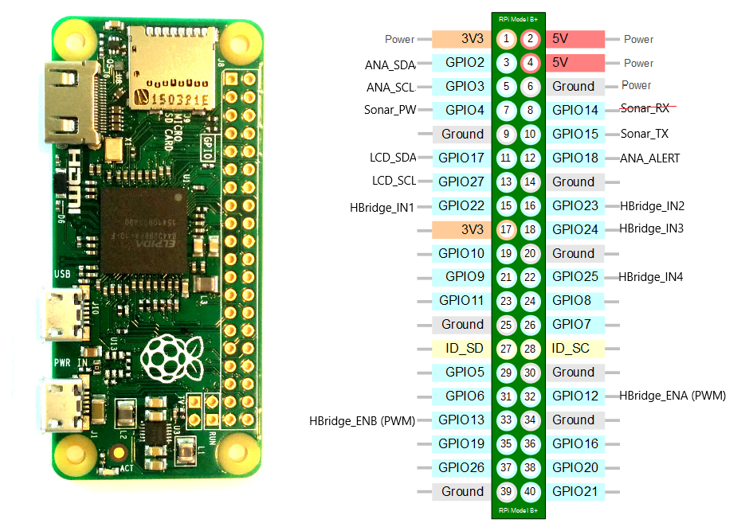

# Raspberry Pi Round Robot

A robotics project for Raspberry Pi Zero W v1.1 featuring camera streaming, motor control, and LCD display capabilities.


## Features

- **Camera Streaming** - MJPEG video streaming over HTTP (Python/C/C++)
- **Motor Control** - L298N H-bridge dual DC motor control with PWM
- **LCD Display** - 16x2 character LCD via I2C (MCP23008)
- **Multi-language Support** - Python, C, and C++ implementations

## Project Structure

```
raspberryPi/
├── camera/          # Camera streaming module
│   ├── python/      # Python implementations
│   ├── c/           # C implementation (V4L2)
│   ├── cpp/         # C++ implementation (OpenCV)
│   ├── tests/       # Unit tests
│   └── build/       # Compiled binaries
│
├── motor/           # Motor control module
│   ├── python/      # Python implementations
│   ├── c/           # C implementations
│   ├── tests/       # Unit tests
│   └── build/       # Compiled binaries
│
├── lcd/             # LCD display module
│   ├── python/      # Python implementation
│   ├── c/           # C implementation
│   ├── tests/       # Unit tests
│   └── build/       # Compiled binaries
│
├── docs/            # Documentation
├── images/          # Project images
└── scripts/         # Build and utility scripts
```

## Quick Start

### 1. Install Dependencies

```bash
# System dependencies
sudo apt-get update
sudo apt-get install -y gcc g++ make wiringpi i2c-tools

# Python dependencies
pip install -r requirements.txt
```

Or use the Makefile:
```bash
make install-deps
```

### 2. Build All Components

```bash
# Using Makefile
make all

# Or using build script
./scripts/build_all.sh
```

### 3. Run Components

#### Camera Stream
```bash
# Python (recommended for beginners)
python camera/python/camera_stream.py

# C (low latency)
./camera/build/c_stream

# C++ (feature-rich)
./camera/build/stream

# Access stream at: http://<pi-ip>:8000/video_feed
```

#### Motor Control
```bash
# Start motor controller
./motor/build/moto_fifo &

# Send commands
echo "fw" > /tmp/motor_control_fifo  # Forward
echo "bw" > /tmp/motor_control_fifo  # Backward
echo "st" > /tmp/motor_control_fifo  # Stop
```

#### LCD Display
```bash
# Python
python lcd/python/lcd_test.py

# C
./lcd/build/lcd_driver
```

## Hardware Configuration

### Motor Driver (L298N H-Bridge)



**GPIO Pin Connections:**
- **IN1** → GPIO 22 (Motor 1 Direction)
- **IN2** → GPIO 23 (Motor 1 Direction)
- **IN3** → GPIO 24 (Motor 2 Direction)
- **IN4** → GPIO 25 (Motor 2 Direction)
- **ENA** → GPIO 12 (Motor 1 PWM Speed)
- **ENB** → GPIO 13 (Motor 2 PWM Speed)

### LCD Display (I2C)
- **I2C Address:** 0x20 (MCP23008)
- **SDA** → GPIO 2
- **SCL** → GPIO 3

### Camera
- CSI Camera Port or USB Camera

## Documentation

- [Hardware Setup Guide](docs/hardware_setup.md)
- [Camera Usage](docs/camera_usage.md)
- [Motor Control](docs/motor_control.md)
- [LCD Display](docs/lcd_display.md)
- [API Reference](docs/api_reference.md)

## Testing

```bash
# Run all tests
./scripts/run_tests.sh

# Or use pytest directly
python -m pytest camera/tests/ motor/tests/ lcd/tests/ -v

# Run with coverage
python -m pytest --cov=camera/python --cov=motor/python --cov=lcd/python
```

## Makefile Targets

```bash
make all          # Build all components
make camera       # Build camera modules
make motor        # Build motor modules
make lcd          # Build LCD module
make test         # Run all tests
make clean        # Clean build artifacts
make install-deps # Install dependencies
make help         # Show help
```

## Module READMEs

- [Camera Module](camera/README.md)
- [Motor Control](motor/README.md)
- [LCD Display](lcd/README.md)

## Development

### Directory Structure
Each module follows the same structure:
- `python/` - Python implementations
- `c/` - C implementations
- `cpp/` - C++ implementations (if applicable)
- `tests/` - Unit and integration tests
- `build/` - Compiled binaries (gitignored)
- `README.md` - Module-specific documentation

### Build System
- **Makefile** - C/C++ build automation
- **requirements.txt** - Python dependencies
- **scripts/** - Build and utility scripts

## Troubleshooting

### Camera Not Working
```bash
# Enable camera
sudo raspi-config  # Interface Options → Camera

# Check detection
vcgencmd get_camera
```

### Motor Not Running
```bash
# Install WiringPi
sudo apt-get install wiringpi

# Test GPIO
gpio readall
```

### LCD Not Detected
```bash
# Enable I2C
sudo raspi-config  # Interface Options → I2C

# Scan I2C bus
i2cdetect -y 1
```

## Contributing

1. Follow the existing code structure
2. Add tests for new features
3. Update documentation
4. Use consistent coding style (see `.gitignore` for ignored files)

## License

This project is open source and available for educational purposes.

## Author

Marius-U

## Repository

https://github.com/Marius-U/raspberryPi
