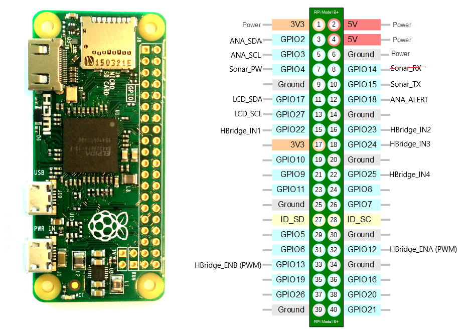
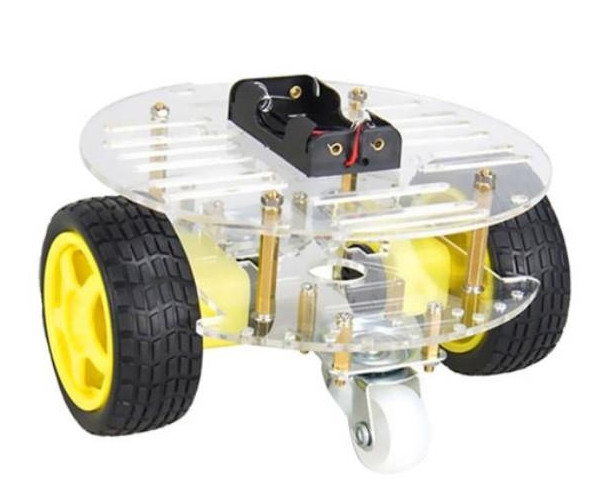

# Hardware Setup Guide

## Raspberry Pi Zero W v1.1 Pinout



## Components

### 1. Motor Driver (L298N H-Bridge)

The L298N H-bridge motor driver controls two DC motors.

**GPIO Pin Connections:**
- **IN1** → GPIO 22 (Motor 1 Direction)
- **IN2** → GPIO 23 (Motor 1 Direction)
- **IN3** → GPIO 24 (Motor 2 Direction)
- **IN4** → GPIO 25 (Motor 2 Direction)
- **ENA** → GPIO 12 (Motor 1 PWM Speed Control)
- **ENB** → GPIO 13 (Motor 2 PWM Speed Control)

**Power:**
- Motor power: 7-12V (external power supply)
- Logic power: 5V from Raspberry Pi

### 2. Camera Module

**Supported Cameras:**
- Raspberry Pi Camera Module v1/v2
- Raspberry Pi Camera Module 3
- USB cameras (for V4L2 implementation)

**Connection:**
- CSI camera: Connect to CSI port on Raspberry Pi
- USB camera: Connect to USB port

**Enable Camera:**
```bash
sudo raspi-config
# Interface Options → Camera → Enable
```

### 3. LCD Display (16x2 with I2C)

**MCP23008 I2C I/O Expander:**
- **I2C Address:** 0x20
- **SDA** → GPIO 2 (I2C Data)
- **SCL** → GPIO 3 (I2C Clock)

**LCD Pin Mapping (via MCP23008):**
- **RS** → MCP Pin 1
- **E** → MCP Pin 2
- **D4** → MCP Pin 3
- **D5** → MCP Pin 4
- **D6** → MCP Pin 5
- **D7** → MCP Pin 6
- **Backlight** → MCP Pin 7

**Enable I2C:**
```bash
sudo raspi-config
# Interface Options → I2C → Enable

# Verify I2C device
i2cdetect -y 1
```

### 4. Additional Sensors (Future)

- Sonar proximity sensor (HC-SR04)
- Analog to Digital Converter (MCP3008)

## Round Robot Assembly



The robot chassis includes:
- Raspberry Pi Zero W as main controller
- L298N motor driver
- Two DC motors with wheels
- Camera module for vision
- LCD display for status
- Battery pack for power

## Power Supply

- **Raspberry Pi:** 5V 2A (via micro USB or GPIO pins)
- **Motors:** 7-12V (via L298N external power input)
- **Shared Ground:** Connect all ground pins together

## Safety Notes

- Always connect grounds between Raspberry Pi and motor driver
- Never exceed voltage ratings
- Use proper gauge wires for motor current
- Add flyback diodes for motor protection
